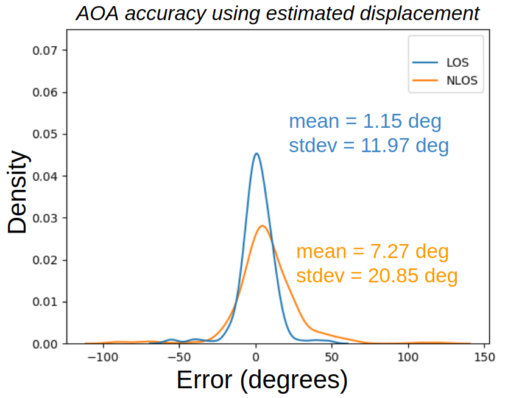

# WSR-Toolbox-Dataset

<div align="center">
  <a href="https://react.seas.harvard.edu//">
    
  </a>
  <a href="https://react.seas.harvard.edu/communication-sensor">
    
  </a>
  <a href="https://www.seas.harvard.edu/">
    
  </a>
</div>
<p>&nbsp;</p>

# Testbed area
The total testbed area is approx 150 sq. meters and comprises of six separate locations. These include the main testbed with motion capture system and five locations that  are  in  NLOS.  The  locations  are  general  office areas  and include  like  chairs,  tables,  glass  door,  electronics,  metalshelves,  etc. Additional description and details of the setup are available in our paper [**Toolbox  Release:  A  WiFi-Based  Relative  Bearing  Sensor  for  Robotics**](https://arxiv.org/abs/2109.12205)

# Datasets
 This includes data  samples  across  a  total  of  ten positions  of  receiving (RX)  robot  arranged  in  a  grid  which  are at  a  minimum  distance  of  2.5m  from  a  Line-of-Sight (LOS)  transmitting (TX) robot  position. For  Non-line-of-sight (NLOS), TX robots  are  placed at  different  positions  in  adjacent  office  spaces. A total of about 600 data samples were collected for this dataset.


The directory structure is as follows: 
```
├── config_files
├── Dataset
│   ├── 2D-Displacement_output_files
│   │   ├── default_configuration
│   │   ├── low_and_sub_configuration
│   │   ├── low_res_configuration
│   │   └── sub_sample_configuration
│   └── 2D-Displacement_raw_data
│       ├── LOS_Set_A
│       │   ├── 0627_2D-multi-link_A_L1
│       │   ├── 0627_2D-multi-link_A_L10
│       │   ├── 0627_2D-multi-link_A_L2
│       │   ├── 0627_2D-multi-link_A_L3
│       │   ├── 0627_2D-multi-link_A_L4
│       │   ├── 0627_2D-multi-link_A_L5
│       │   ├── 0627_2D-multi-link_A_L6
│       │   ├── 0627_2D-multi-link_A_L7
│       │   ├── 0627_2D-multi-link_A_L8
│       │   └── 0627_2D-multi-link_A_L9
│       ├── LOS_Set_B
│       │   ├── 0628_2D-multi-link_B_L1
│       │   ├── 0628_2D-multi-link_B_L10
│       │   ├── 0628_2D-multi-link_B_L2
│       │   ├── 0628_2D-multi-link_B_L3
│       │   ├── 0628_2D-multi-link_B_L4
│       │   ├── 0628_2D-multi-link_B_L5
│       │   ├── 0628_2D-multi-link_B_L6
│       │   ├── 0628_2D-multi-link_B_L7
│       │   ├── 0628_2D-multi-link_B_L8
│       │   └── 0628_2D-multi-link_B_L9
│       ├── NLOS_Set_A
│       │   ├── 0627_2D-multi-link_NLOS_A_L1
│       │   ├── 0627_2D-multi-link_NLOS_A_L10
│       │   ├── 0627_2D-multi-link_NLOS_A_L2
│       │   ├── 0627_2D-multi-link_NLOS_A_L3
│       │   ├── 0627_2D-multi-link_NLOS_A_L4
│       │   ├── 0627_2D-multi-link_NLOS_A_L5
│       │   ├── 0627_2D-multi-link_NLOS_A_L6
│       │   ├── 0627_2D-multi-link_NLOS_A_L7
│       │   ├── 0627_2D-multi-link_NLOS_A_L8
│       │   └── 0627_2D-multi-link_NLOS_A_L9
│       ├── NLOS_Set_B
│       │   ├── 0629_2D-multi-link_NLOS_B_L1
│       │   ├── 0629_2D-multi-link_NLOS_B_L10
│       │   ├── 0629_2D-multi-link_NLOS_B_L2
│       │   ├── 0629_2D-multi-link_NLOS_B_L3
│       │   ├── 0629_2D-multi-link_NLOS_B_L4
│       │   ├── 0629_2D-multi-link_NLOS_B_L5
│       │   ├── 0629_2D-multi-link_NLOS_B_L6
│       │   ├── 0629_2D-multi-link_NLOS_B_L7
│       │   ├── 0629_2D-multi-link_NLOS_B_L8
│       │   └── 0629_2D-multi-link_NLOS_B_L9
│       └── NLOS_Set_C
│           ├── 2D-multilink-NLOS_L1
│           ├── 2D-multilink-NLOS_L10
│           ├── 2D-multilink-NLOS_L2
│           ├── 2D-multilink-NLOS_L3
│           ├── 2D-multilink-NLOS_L4
│           ├── 2D-multilink-NLOS_L5
│           ├── 2D-multilink-NLOS_L6
│           ├── 2D-multilink-NLOS_L7
│           ├── 2D-multilink-NLOS_L8
│           └── 2D-multilink-NLOS_L9
└── figs
```

- config_files : Constains the configuration parameters used to process the data
- 2D-Displacement_output_files : Processed output data in json format
- 2D-Displacement_raw_data: Raw data files collected for each location of receiving robot (location 1 to 10) for a given position configuration of 3 Transmitting robots (A,B or C).

Each location directory (e.g) 0627_2D-multi-link_A_L10) contains the following raw file:

```
├── csi_rx_*.dat
├── csi_tx2_*.dat
├── csi_tx3_*.dat
├── csi_tx4_*.dat
├── groundtruth_positions.json
├── odom_rx_trajectory_*.csv
├── rx_trajectory_*.csv
├── t265_rx_trajectory_*.csv

```

- csi_rx* : The [CSI data](https://github.com/Harvard-REACT/WSR-Toolbox/wiki/System-Architecture#input-data-streams) file collected by a receiving robot
- csi_tx* : The CSI data file simultanesouly collected on all transmitting robots
- rx_trajectory* : Groundtruth [displacement](https://github.com/Harvard-REACT/WSR-Toolbox/wiki/System-Architecture#input-data-streams) of receiving robot obtained using optitrack motion capture system.
- t265_rx_trajectory* : Estimated displacement of the receiving robot obtained using VIO sensor ([Intel t265 tracking camera](https://github.com/IntelRealSense/librealsense/blob/master/doc/t265.md)).
- odom_rx_trajectory* : Estimated displacement using robot odometer.


## Performance evaluation for 2D Trajectory
The following plot shows aggregate results for the AOA estimation accuracy using estimated robot displacement in non-line-of-sight. 



**Additional results for AOA estimation performance are available at our [Wiki Page](https://github.com/Harvard-REACT/WSR-Toolbox/wiki/Relative-Bearing-Accuracy)**


### Localization performance for NLOS scenario
The transmitting robot positions are assumed to be know and we use the entire data for all the position configuration of the robots (i.e data for LOS and data for NLOS). The receiving robot can localize itself using the bearing angle calculated from our framework. We use the [profile variance](https://github.com/Harvard-REACT/WSR-Toolbox/wiki/Terminology#profile-variance) metric discussed in  to reject outlying measurements. 

Results Coming soon!!

**Additional results for the dataset are available at our [Wiki Page](https://github.com/Harvard-REACT/WSR-Toolbox/wiki/Multi-robot-localization)**

## Citation
If this dataset is is useful for your research publications, please cite our work.

- [1] Ninad Jadhav, Weiying Wang, Diana Zhang, Swarun Kumar and Stephanie Gil. [**Toolbox  Release:  A  WiFi-Based  Relative  Bearing  Sensor  for  Robotics**](https://arxiv.org/abs/2109.12205).
 
 ```bibtex
@article{WSR_toolbox,
  title={Toolbox  Release:  A  WiFi-Based  Relative  Bearing  Sensor  for  Robotics},
  author={Ninad Jadhav and Weiying Wang and Diana Zhang and Swarun Kumar and Stephanie Gil},
  journal={},
  year={},
  volume={}
}
```

- [2] Ninad Jadhav*, Weiying Wang*, Diana Zhang, O. Khatib, Swarun Kumar and Stephanie Gil. [**WSR: A WiFi Sensor for Collaborative Robotics**](https://arxiv.org/abs/2012.04174) (* denotes co-primary authors)

```bibtex
@article{Jadhav2020WSRAW,
  title={WSR: A WiFi Sensor for Collaborative Robotics},
  author={Ninad Jadhav and Weiying Wang and Diana Zhang and O. Khatib and Swarun Kumar and Stephanie Gil},
  journal={ArXiv},
  year={2020},
  volume={abs/2012.04174}
}
```


