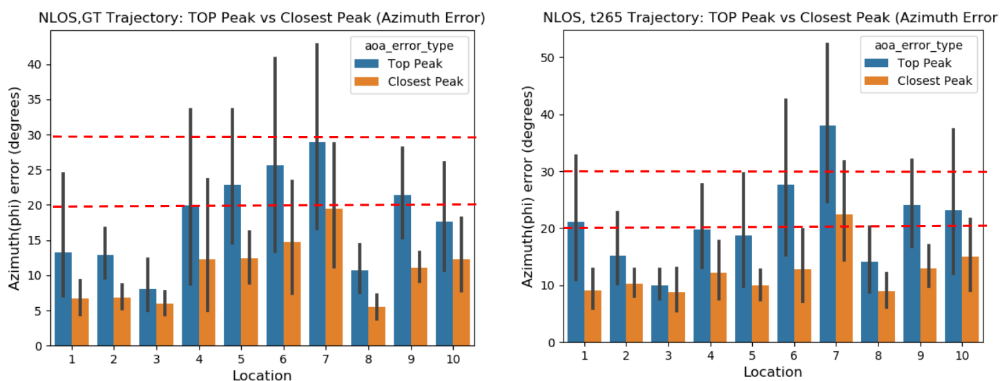
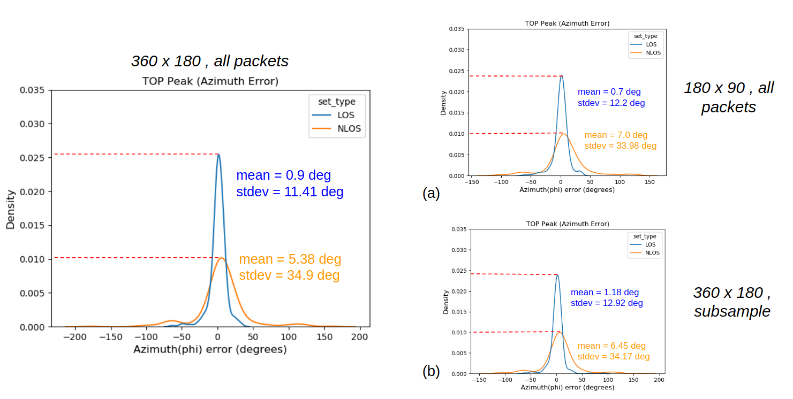

# WSR-Toolbox-Dataset

  
  
  

&nbsp;

# Testbed area
The total testbed area is approx 150 sq. meters and comprises of six separate locations. These include the main testbed with motion capture system and five locations that  are  in  NLOS.  The  locations  are  general  office areas  and include  like  chairs,  tables,  glass  door,  electronics,  metalshelves,  etc.

# Dataset-1
 This includes data  samples  across  a  total  of  ten positions  of  receiving (RX)  robot  arranged  in  a  grid  which  are at  a  minimum  distance  of  2.5m  from  a  LOS  transmitting (TX) robot  position. For  NLOS, TX robots  are  placed at  different  positions  in  adjacent  office  spaces. A total of 600 data samples were collected for this dataset.

## Performance evaluation for 2D Trajectory

### Location-wise AOA accuracy for NLOS scenario
The bearing angle i.e Angle-of-Arrival accuracy in NLOS using groundtruth and T265 Tracking camera trajectory:

### Localization performance for NLOS scenario
The transmitting robot positions are assumed to be know. The receiving robot can localize itself using the bearing angle calculated from our framework. We use the profile variance metric discussed in [**Toolbox  Release:  A  WiFi-Based  Relative  Bearing  Sensor  for  Robotics**]() to reject outlying measurements. 

The localization accuracy for non-line-of-sight by directly using the data

  
  

&nbsp;

The profile variance metric conveys the confidence in AOA estimation. We filter out "noisy" AOA estimates (highly impacted by signal multipath) using a variance threshold, which can be used to improve localization accuracy.

  
  

&nbsp;

## Performance - Runtime tradeoff using different config parameters
To achieve better online runtime, different parameters in the config file can be tweaked with minimal impact on AOA accuracy. The following plots compare the AOA accuracy for all onboard sensing using a) lower resolution of profile and b) Subsampling - using alternate data packets. The defult config parameters use all the data packets to generate a profile with resolution 360 x 180.

