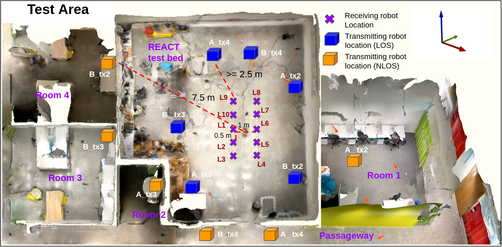
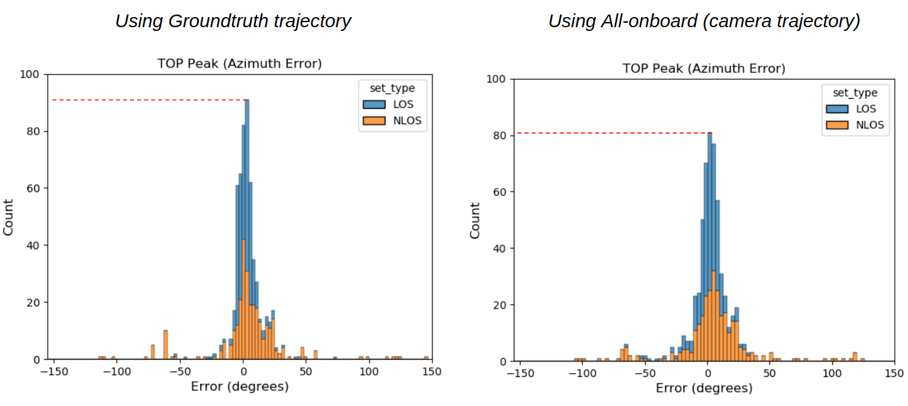
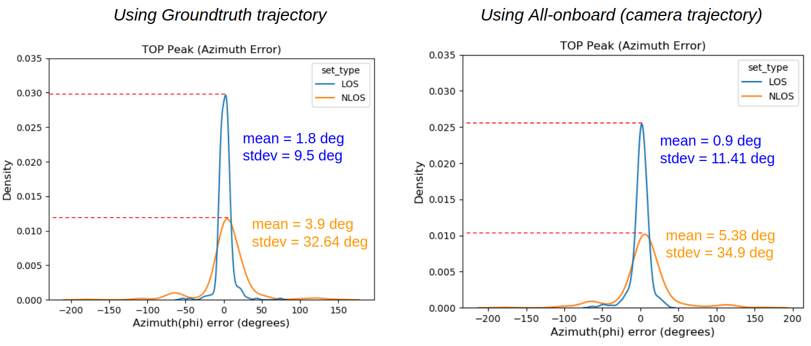
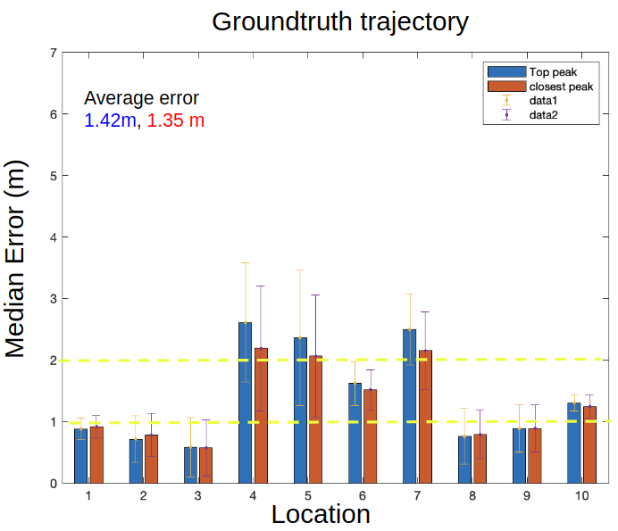
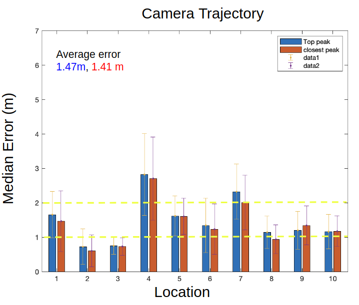
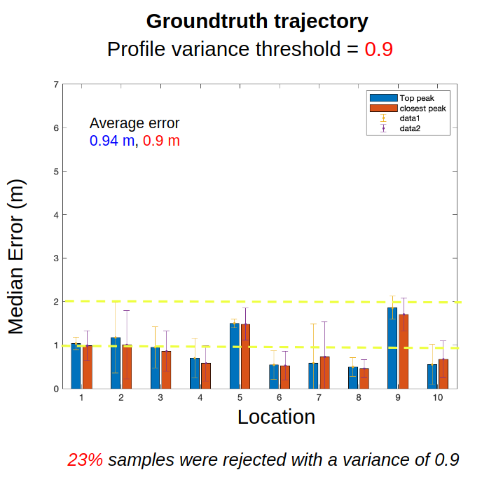
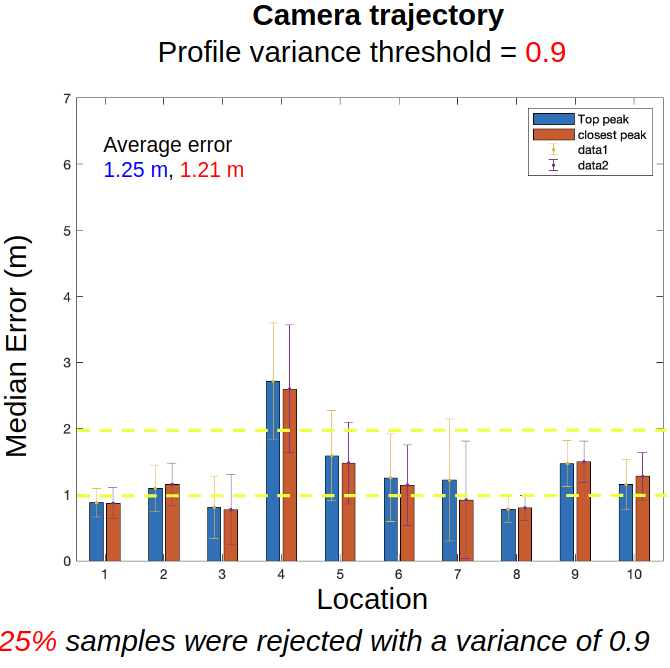

# WSR-Toolbox-Dataset

  
  
  

&nbsp;

# Testbed area
The total testbed area is approx 150 sq. meters and comprises of six separate locations. These include the main testbed with motion capture system and five locations that  are  in  NLOS.  The  locations  are  general  office areas  and include  like  chairs,  tables,  glass  door,  electronics,  metalshelves,  etc.

# Dataset-1
 This includes data  samples  across  a  total  of  ten positions  of  receiving (RX)  robot  arranged  in  a  grid  which  are at  a  minimum  distance  of  2.5m  from  a  LOS  transmitting (TX) robot  position. For  NLOS, TX robots  are  placed at  different  positions  in  adjacent  office  spaces. A total of 600 data samples were collected for this dataset.

### AOA accuracy for 2D Trajectory

### Localization performance for NLOS scenario
The transmitting robot positions are assumed to be know. The receiving robot can localize itself using the bearing angle calculated from our framework. We use the profile variance metric discussed in [**Toolbox  Release:  A  WiFi-Based  Relative  Bearing  Sensor  for  Robotics**]() to reject outlying measurements. 

The localization accuracy for non-line-of-sight by directly using the data

  
  

&nbsp;

The profile variance metric conveys the confidence in AOA estimation. We filter out "noisy" AOA estimates (highly impacted by signal multipath) using a variance threshold, which can be used to improve localization accuracy. About **x% of samples are rejected by this simple filtering method**

  
  

&nbsp;

# Dataset-2

The 2D motion would be corresponding to commonmotion  for  normal  ground  robots;  3D  hand-held  arbitrary motion  reflects  the  mobility  of  a  UAV. The  experiment  is  performed  in  two  scenarios:  Line-of-sight  (LOS)  and  Non-line-of-sight  (NLOS).  The  LOS experiments are all conducted on the right half of the test bed including positions 1 to 10. The NLOS ex-periments are carried out by putting the RX robot  in  the  testbed  with  TX  robots  in  other  rooms, occluded  by  a  wall,  at  positions  14,  15  and  16.

Note: Additional data samples in gitlab repo
